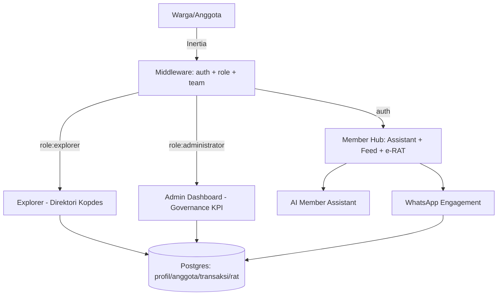

# KOPERA-PLUS — AI-Powered Cooperative Engagement Platform

Platform keterlibatan koperasi berbasis AI untuk **Hackathon Digital Cooperatives Expo 2026 — Kementerian Koperasi RI**, **Tema 3: Peningkatan Keterlibatan Masyarakat dalam Berkoperasi**.

Tujuan: membuat berkoperasi lebih mudah, transparan, dan menarik melalui AI Member Assistant, Gamifikasi, Smart Governance (e-RAT), dan Kopdes Community — di atas data referensi SIMKOPDES yang disediakan panitia.

---

## Tech Stack (implementasi nyata)

| Layer | Teknologi |
|-------|-----------|
| Frontend | Inertia.js v3 + React 19 + TypeScript, Tailwind CSS v4, Flux UI (Livewire v4) untuk admin |
| Backend | Laravel 13 (PHP 8.3), Fortify (auth), Spatie Laravel Permission (RBAC), Wayfinder (typed routes) |
| Engagement | `kstmostofa/laravel-whatsapp` (Meta Cloud API + whatsapp-web.js) |
| Database | PostgreSQL (produksi/live), SQLite (dev lokal), Eloquent ORM |
| AI | AI Member Assistant saat ini *heuristic* client-side; integrasi LLM direncanakan (lihat `docs/ai-disclosure.md`) |
| Tooling | Laravel Boost MCP, Chisel, Pint, PHPUnit/Pest, ESLint, Prettier, Impeccable |

> Stack AI masih berupa illustration di MVP — tidak ada klaim koneksi model eksternal. Lihat `docs/ai-disclosure.md`.

---

## Requirement

- PHP >= 8.3, Composer
- Node >= 20, npm
- PostgreSQL >= 14 (atau SQLite untuk dev cepat)
- Akses ke `docs/backup-hackathon_*.sql` (data referensi SIMKOPDES)

---

## Installation (dev lokal)

```sh
# 1. Dependensi
composer install
npm install

# 2. Environment
cp .env.example .env          # sesuaikan DB_*
php artisan key:generate

# 3. Database
#    Opsi A (SQLite, cepat): DB_CONNECTION=sqlite, buat database/database.sqlite
#    Opsi B (PostgreSQL, sama seperti live):
#      DB_CONNECTION=pgsql
#      DB_HOST=... DB_PORT=5432 DB_DATABASE=... DB_USERNAME=... DB_PASSWORD=...
#    Restore data referensi panitia (jika pakai Postgres):
#      pg_restore -d "$DATABASE_URL" docs/backup-hackathon_2026-202607101855.sql

# 4. Migrasi + seed (struktur app: users, teams, wa_*, permissions)
php artisan migrate --seed

# 5. Frontend
npm run dev                   # Vite dev (SSR otomatis via @inertiajs/vite)
# atau build: npm run build
```

Buka URL yang ditampilkan Vite/Artisan. Tidak ada langkah deploy — aplikasi sudah live di hosting mandiri + PostgreSQL.

---

## Architecture (ringkas)



Penjelasan lengkap: `docs/architecture.md`. Pemetaan tabel dump → fitur: `docs/data-model.md`.

---

## Module Map

| Modul | Dokumen | Status |
|-------|---------|--------|
| AI Member Assistant | `docs/modules/ai-member-assistant.md` | Sebagian (UI ada, AI mock) |
| Gamification & Loyalty | `docs/modules/gamification-loyalty.md` | Belum |
| Smart Governance + e-RAT | `docs/modules/e-rat-governance.md` | Sebagian |
| Kopdes Community | `docs/modules/kopdes-community.md` | Sebagian |
| Auth & RBAC | `docs/modules/auth-rbac.md` | Sebagian (ada gap) |
| Teams / Multi-tenant | `docs/modules/teams-multitenant.md` | Ada |
| WhatsApp Engagement | `docs/modules/whatsapp-engagement.md` | Ada |
| Sidebar / Navigation | `docs/modules/sidebar-navigation.md` | Belum (redesign) |

Tasklist lengkap & status: `todolist.md`. PRD (sudah direvisi): `docs/prd.md`.

---

## AI Disclosure (TOR Aturan J)

Ide inti (pemetaan masalah koperasi → solusi partisipasi) adalah karya tim. AI generatif dipakai sebagai alat bantu teknis (penulisan/pemeriksaan kode, draft dokumentasi). Tidak ada gagasan utama yang dihasilkan langsung oleh AI. Detail: `docs/ai-disclosure.md`.

---

## Localization

Target 100% Bahasa Indonesia. Status terkini & daftar string tersisa: `docs/localization.md`.

---

## Submission Checklist (TOR)

- [x] Repositori kode publik
- [~] README ini + `docs/prd.md`
- [ ] Pitch deck PDF (10–12 slide)
- [ ] Demo live + kredensial juri (explorer / member / administrator)
- [~] `docs/ai-disclosure.md`
- [ ] Video demo (opsional)

Kredensial juri: isi di sini sebelum pengumpulan (akun uji tiap peran).
