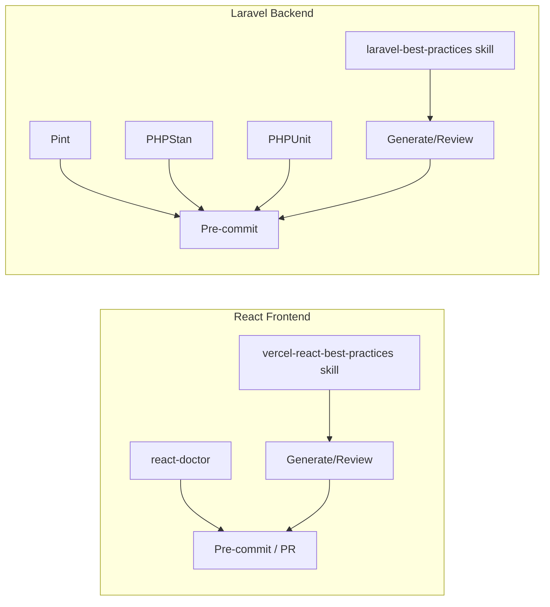

# Technical Quality Gate — Performance & Maintainability

Gerbang kualitas yang **selalu dijalankan** agar KOPERA-PLUS tetap cepat dan
maintainable. Dua domain: **React frontend** dan **Laravel backend**. Semua
check di bawah bersifat deterministik (alat) atau wajib (skill) saat generate/review.



---

## A. React Frontend

### A.1 Skill: Vercel React Best Practices
- Sumber: <https://github.com/vercel-labs/agent-skills/tree/main/skills/react-best-practices>
- 70 aturan / 8 kategori (prioritas dampak):
  1. **Eliminating Waterfalls** (CRITICAL): `async-parallel` (`Promise.all`), `async-defer-await`, `async-api-routes` (start promise early, await late), `async-suspense-boundaries`.
  2. **Bundle Size** (CRITICAL): `bundle-barrel-imports` (import langsung, hindari barrel), `bundle-dynamic-imports` (`React.lazy`/`next/dynamic` untuk komponen berat), `bundle-defer-third-party` (load analytics setelah hydration), `bundle-conditional`.
  3. **Server-Side** (HIGH): `server-cache-react` (`React.cache()` dedupe per-request), `server-serialization` (minimalkan props ke client), `server-parallel-fetching`, `server-hoist-static-io`.
  4. **Client-Side Fetching** (MED-HIGH): `client-swr-dedup`, `client-event-listeners` (dedupe listener global), `client-passive-event-listeners`.
  5. **Re-render** (MED): `rerender-memo`, `rerender-no-inline-components` (jangan definisikan komponen di dalam komponen), `rerender-use-deferred-value`, `rerender-transitions` (`startTransition`), `rerender-derived-state` (derive saat render, bukan effect).
  6. **Rendering** (MED): `rendering-content-visibility` (list panjang), `rendering-hoist-jsx` (static JSX di luar komponen), `rendering-conditional-render` (pakai ternary, bukan `&&`), `rendering-activity`.
  7. **JS Performance** (LOW-MED): `js-set-map-lookups`, `js-combine-iterations`, `js-early-exit`, `js-index-maps`.
  8. **Advanced** (LOW): `advanced-init-once`, `advanced-use-latest`.
- **Penerapan**: agen WAJIB mengaktifkan skill ini saat menulis/mereview React.
  Pasang ke `.agents/skills/react-best-practices/` (salim `SKILL.md` + `rules/*`
  dari repo Vercel) agar auto-trigger, atau fetch on-demand.

### A.2 Tool: react-doctor (Million)
- Paket npm: `react-doctor` — scannya deterministik: **state & effects, performance, architecture, security, accessibility**. Framework-agnostic (Vite/React/Next/RN).
- Perintah:
  - Audit lokal: `npx react-doctor@latest`  (atau `npm run doctor`)
  - Pasang skill ke coding agent: `npx react-doctor@latest install`
  - Gate per-PR (GitHub Actions): `npx react-doctor@latest ci install` (hanya lapor issue dari perubahan Anda, bukan backlog)
  - Matikan telemetry: `--no-telemetry` / `doctor.config.ts`
- Konfigurasi: `doctor.config.ts` (sudah ada di root, scope `resources/js`, telemetry off). Tune dengan `npx react-doctor@latest ci config`.
- Script `package.json`: `"doctor": "npx react-doctor@latest"`, `"doctor:ci": "npx react-doctor@latest ci"`.

---

## B. Laravel Backend

### B.1 Skill: Laravel Best Practices (karuhun / lokal)
- Sumber: <https://www.skillsdirectory.com/skills/karuhun-developer-laravel-best-practices>
- Sudah terpasang lokal: `.agents/skills/laravel-best-practices/` (AGENTS.md mewajibkan aktivasi saat kerja Laravel).
- 19 kategori (ringkas):
  - **DB Performance**: `with()` cegah N+1, `Model::preventLazyLoading()` di dev, `select` kolom perlu, `chunkById` dataset besar, index `WHERE/ORDER/JOIN`, `withCount`.
  - **Advanced Queries**: `addSelect()` subquery, `whereIn`+`pluck` vs `whereHas`, compound index cocok `orderBy`.
  - **Security**: `$fillable`/`$guarded`, policy/gate tiap aksi, `{{ }}` escape, `@csrf`, `throttle`, validasi upload.
  - **Caching**: `Cache::remember()` / `Cache::flexible()`, `Cache::memo()`, `once()`, `Cache::lock()`.
  - **Eloquent**: tipe relasi + return hint, local scope, `whereBelongsTo()`, casts.
  - **Validation**: Form Request class, `$request->validated()` (bukan `all()`).
  - **Queue/Jobs**: `retry_after` > `timeout`, `ShouldBeUnique`, `failed()`, `RateLimited`.
  - **Routing/Controllers**: implicit binding, `Route::resource()`, metode < 10 baris (extract ke Action).
  - **Architecture**: Action single-purpose, DI over `app()`, `defer()` / `Context` / `Concurrency::run()`.
  - **Migrations**: `make:migration`, `constrained()`, jangan ubah migrasi produksi, 1 concern/migration.
  - + Collections, Events/Notifications/Mail, Error Handling, Scheduling, Blade, Style, Config, Testing, HTTP Client.
- **Bootstrap wajib**: `Model::preventLazyLoading()` di `AppServiceProvider` (env dev) agar N+1 langsung terlihat.

### B.2 Tools (sudah terpasang)
- **Pint** (style): `vendor/bin/pint --format agent`
- **PHPStan** (static): `php artisan config:show` + `phpstan analyse` (via `composer test`/`types:check`)
- **PHPUnit** (test): `php artisan test --compact`
- **Boost `search-docs`**: selalu cek API versi-specific sebelum tulis Laravel.

---

## C. Coordinated Gate (Pre-commit + CI)

Pre-commit (Husky atau `.git/hooks/pre-commit`), urutan:
```sh
npm run lint:check        # ESLint
npm run format:check      # Prettier
npm run types:check       # tsc --noEmit
npx react-doctor@latest --no-telemetry   # React gate
vendor/bin/pint --test --format agent    # PHP style
phpstan analyse                          # PHP static
```
PR / CI (GitHub Actions, `.github/workflows`):
```sh
npm run doctor:ci         # react-doctor ci (komentar PR)
php artisan test --compact
```

## D. Budget & Metric (target)
- Bundle: hindari barrel import; lazy-load halaman berat (`admin-dashboard`, `explorer-dashboard`).
- Render: list panjang pakai `content-visibility`; jangan inline komponen.
- Query: nol N+1 di dashboard (pakai `with`/`withCount` saat wire Postgres).
- Test: hijau sebelum merge (`php artisan test --compact`).

---

## E. Status & TODO (lihat `todolist.md` M16)
- [x] Pint / PHPStan / PHPUnit / ESLint / Prettier / Impeccable terpasang
- [x] `laravel-best-practices` skill aktif (lokal `.agents/skills/laravel-best-practices`) — auto-trigger
- [x] `vercel-react-best-practices` skill terpasang (`.agents/skills/react-best-practices`) — auto-trigger
- [x] Pre-commit gate terpasang (`.githooks/pre-commit`): eslint + prettier + tsc + react-doctor + pint + phpstan + impeccable; bloc ker commit bad code. Pastikan aktif: `git config core.hooksPath .githooks` (sudah jika hook lama jalan) & `chmod +x .githooks/pre-commit`.
- [~] `react-doctor` perlu `npm install` lalu audit pertama (`npm run doctor`)
- [ ] `react-doctor ci install` (PR gate GitHub Actions)
- [ ] `Model::preventLazyLoading()` di `AppServiceProvider` (dev) — deteksi N+1
